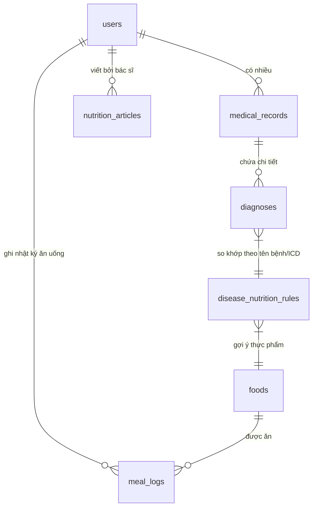

# HƯỚNG DẪN QUY TRÌNH LÀM VIỆC - PHÂN HỆ DINH DƯỠNG
## (NUTRITION MANAGEMENT WORKFLOW GUIDE)

Phân hệ **Quản lý Chế độ Dinh dưỡng** trong hệ thống quản lý bệnh viện cung cấp các kế hoạch ăn uống, theo dõi lượng calo nạp vào hàng ngày, và cung cấp lời khuyên y tế dựa trên hồ sơ bệnh án thực tế của bệnh nhân.

Tài liệu này hướng dẫn chi tiết quy trình làm việc (workflow), luồng xử lý dữ liệu và cách vận hành các chức năng cho cả hai vai trò: **Bác sĩ Dinh dưỡng / Admin** và **Bệnh nhân**.

---

## 1. PHÂN QUYỀN TRONG HỆ THỐNG (ROLES & PERMISSIONS)

| Vai trò | Quyền hạn trong Phân hệ Dinh dưỡng | Middleware kiểm tra |
| :--- | :--- | :--- |
| **Bác sĩ Dinh dưỡng & Admin** | Quản lý Thực phẩm, Thiết lập Quy tắc ăn uống theo bệnh, Viết bài viết lời khuyên | `auth`, `role:1,2` (role_id 1 = Admin, 2 = Doctor) |
| **Bệnh nhân (Đăng nhập)** | Xem gợi ý thực đơn, Ghi nhật ký ăn uống, Tính calo tiêu thụ, Đọc lời khuyên | `auth` |

---

## 2. LUỒNG DỮ LIỆU & KIẾN TRÚC LIÊN KẾT (DATABASE ARCHITECTURE)

Dưới đây là sơ đồ mô tả mối liên hệ giữa các bảng dữ liệu để tạo nên tính năng gợi ý thông minh:

- **Quy trình kết nối:** Khi bệnh nhân khám bệnh xong $\rightarrow$ bác sĩ lưu chẩn đoán vào bảng `diagnoses` $\rightarrow$ Hệ thống lấy 3 chẩn đoán gần nhất của bệnh nhân $\rightarrow$ Đối chiếu với bảng `disease_nutrition_rules` dựa trên `diagnosis_name` hoặc `icd_code` $\rightarrow$ Lấy ra danh sách các món ăn khuyên dùng (`should_eat`) và hạn chế (`should_avoid`) từ bảng `foods`.

---

## 3. QUY TRÌNH LÀM VIỆC DÀNH CHO BÁC SĨ & ADMIN

Bác sĩ Dinh dưỡng hoặc Admin sẽ chuẩn bị dữ liệu nền tảng tại đường dẫn: `http://localhost/admin/nutrition`

### Bước 3.1: Quản lý danh mục thực phẩm (Foods)
*Đường dẫn quản lý:* `/admin/nutrition/foods`
1. Bác sĩ thêm các loại món ăn/nguyên liệu vào hệ thống (ví dụ: *Ức gà luộc*, *Bánh ngọt*, *Cơm trắng*...).
2. Nhập chính xác lượng Calo ước tính trên **100g** thực phẩm (`calories_per_100g`). Đây là chỉ số cốt lõi để hệ thống tự động tính calo cho bệnh nhân sau này.
3. Kích hoạt trạng thái hiển thị (`status = 1` là hiển thị cho bệnh nhân chọn, `status = 0` là ẩn/tạm ngưng cung cấp).

### Bước 3.2: Thiết lập quy tắc dinh dưỡng theo bệnh lý (Rules)
*Đường dẫn quản lý:* `/admin/nutrition/rules`
1. Bác sĩ chọn nút **Thêm quy tắc mới**.
2. Nhập **Tên bệnh lý** trùng với danh mục chẩn đoán lâm sàng (ví dụ: *Đái tháo đường*, *Tăng huyết áp*). Có thể nhập thêm mã **ICD-10** (ví dụ: *E11*, *I10*) để tăng độ chính xác khi đối chiếu.
3. Chọn một món ăn có sẵn từ danh mục thực phẩm.
4. Chọn loại gợi ý:
   - **Nên dùng (`should_eat`):** Các thực phẩm giàu dinh dưỡng có lợi cho tiến trình điều trị của bệnh đó.
   - **Nên tránh (`should_avoid`):** Các thực phẩm dễ gây biến chứng hoặc làm trầm trọng thêm tình trạng bệnh.
5. Viết giải thích y khoa cụ thể vào phần **Lý do khuyến nghị** để bệnh nhân hiểu rõ tầm quan trọng của quy tắc.

### Bước 3.3: Viết bài viết lời khuyên chuyên gia (Articles)
*Đường dẫn quản lý:* `/admin/nutrition`
1. Bác sĩ/Admin tạo các bài viết hướng dẫn chuyên sâu (ví dụ: *Chế độ ăn DASH cho người cao huyết áp*).
2. Thiết lập trường **Bệnh mục tiêu (Target Disease)** (ví dụ: *Tăng huyết áp*).
3. Đặt trạng thái **Xuất bản (Publish)** để bệnh nhân có thể nhìn thấy bài viết trên bảng tin sức khỏe của họ.

---

## 4. QUY TRÌNH LÀM VIỆC DÀNH CHO BỆNH NHÂN

Bệnh nhân đăng nhập và truy cập giao diện dashboard cá nhân tại: `http://localhost/patient/nutrition`

### Bước 4.1: Nhận diện chẩn đoán & Gợi ý thực đơn thông minh
1. **Lấy bệnh án:** Hệ thống tự động truy vấn bảng `medical_records` của bệnh nhân đang đăng nhập, sắp xếp theo thời gian khám để tìm ra 3 chẩn đoán gần nhất trong bảng `diagnoses`.
2. **Hiển thị chẩn đoán:** Các bệnh này được hiển thị rõ ràng trên thanh tiêu đề góc phải màn hình của bệnh nhân.
3. **Hiển thị thực phẩm khuyên dùng/tránh:**
   - Hệ thống tự động so khớp tên bệnh chẩn đoán với bảng quy tắc để liệt kê hai danh sách riêng biệt: **NÊN DÙNG** (nền xanh lá) và **NÊN TRÁNH** (nền đỏ), kèm theo lượng calo tiêu chuẩn và lời khuyên chi tiết từ bác sĩ.

### Bước 4.2: Ghi nhật ký ăn uống hàng ngày
1. Bệnh nhân thực hiện chọn món ăn đã ăn trong ngày thông qua hộp chọn **Món ăn**.
2. Chọn buổi ăn tương ứng (Bữa sáng, trưa, tối hoặc bữa phụ).
3. Nhập khối lượng thực phẩm tính bằng **Gram**.
4. **Xem trước calo:** Khi bệnh nhân nhập khối lượng, mã Javascript lập tức tính toán lượng Calo xem trước theo công thức:
     $$\text{Calo ước tính} = \frac{\text{Calo của món ăn trên 100g} \times \text{Khối lượng ăn (g)}}{100}$$
5. Nhấn **Thêm** để lưu vào nhật ký bữa ăn hôm nay. Bệnh nhân có thể bấm biểu tượng thùng rác để xóa bản ghi nếu nhập sai.

### Bước 4.3: Theo dõi chỉ số Calo nạp vào cơ thể
1. Hệ thống cộng dồn tổng lượng Calo từ tất cả các bữa ăn trong ngày hôm nay.
2. Đối chiếu với mục tiêu chuẩn (mặc định là `2000 kcal/ngày`).
3. Hiển thị tiến trình trực quan bằng thanh **Progress Bar**:
   - Nền màu **Xanh lá**: Lượng calo nạp vào ở mức an toàn (< 75%).
   - Nền màu **Vàng**: Cảnh báo sắp đạt giới hạn (75% - 100%).
   - Nền màu **Đỏ**: Vượt quá lượng calo khuyến nghị hàng ngày (> 100%).
4. Phân tích chi tiết lượng calo theo từng bữa ăn (Sáng, Trưa, Tối, Phụ) để bệnh nhân dễ dàng cân đối thực đơn.

### Bước 4.4: Tiếp cận lời khuyên từ bác sĩ
1. Dưới chân trang, hệ thống hiển thị danh sách các bài viết hướng dẫn chuyên sâu.
2. Bài viết được ưu tiên lọc theo đúng tình trạng bệnh lý hiện tại của bệnh nhân để mang lại giá trị thực tiễn cao nhất. Nếu bệnh nhân chưa có lịch sử khám bệnh, hệ thống sẽ hiển thị các bài viết phổ thông mới nhất.

---

## 5. CÁC TỆP TIN THAM CHIẾU TRONG codebase (SOURCE CODE MAP)

Nếu cần kiểm tra mã nguồn hoặc điều chỉnh giao diện, hãy truy cập các tệp tin sau:

1. **Controller xử lý Logic:**
   - Patient Controller: [PatientNutritionController.php](file:///c:/wamp64/www/BE2_HospitalManagement/app/Http/Controllers/PatientNutritionController.php) (Dashboard của bệnh nhân)
   - Admin Controller: [AdminNutritionController.php](file:///c:/wamp64/www/BE2_HospitalManagement/app/Http/Controllers/AdminNutritionController.php) (CRUD của bác sĩ/admin)
2. **Khai báo Định tuyến:** [nutrition.php](file:///c:/wamp64/www/BE2_HospitalManagement/routes/nutrition.php) (Tách biệt các route admin và patient)
3. **Mẫu Giao diện (Views):**
   - Patient view: [index.blade.php](file:///c:/wamp64/www/BE2_HospitalManagement/resources/views/nutrition/patient/index.blade.php)
   - Layout chung: [nutrition.blade.php](file:///c:/wamp64/www/BE2_HospitalManagement/resources/views/layouts/nutrition.blade.php)
   - Admin Views: thư mục [nutrition/admin/](file:///c:/wamp64/www/BE2_HospitalManagement/resources/views/nutrition/admin/) (bao gồm cả thư mục con `rules/` và `foods/`)
4. **Các Model liên quan:**
   - [Food.php](file:///c:/wamp64/www/BE2_HospitalManagement/app/Models/Food.php)
   - [DiseaseNutritionRule.php](file:///c:/wamp64/www/BE2_HospitalManagement/app/Models/DiseaseNutritionRule.php)
   - [MealLog.php](file:///c:/wamp64/www/BE2_HospitalManagement/app/Models/MealLog.php)
   - [NutritionArticle.php](file:///c:/wamp64/www/BE2_HospitalManagement/app/Models/NutritionArticle.php)
